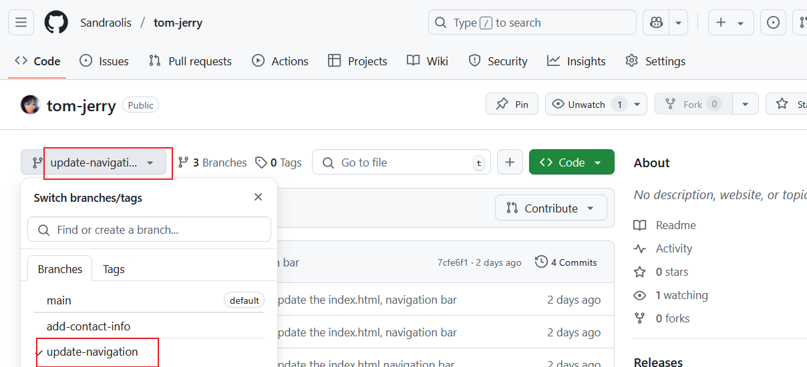

# Part 3 Merging Changes

## Steps:

1. ### Switch to Tom's branch, Update-navigation: 


2. ### Create new pull request:


# Updating Jerry's Branch with latest changes

## Steps:

1. ### Switch to Jerry's branch:

``` bash
git checkout add-contact-info
```


2. ### Pull the changes from the main branch
``` bash
git pull origin main
```


## Finalizing Jerry's Contribution

## Steps:
1. ### Push the updated version to github by following the github workflow

``` bash
git add .
```
``` bash
git commit -m "pushing the updated version to github"
```
``` bash
git push origin add-contact-info
```

